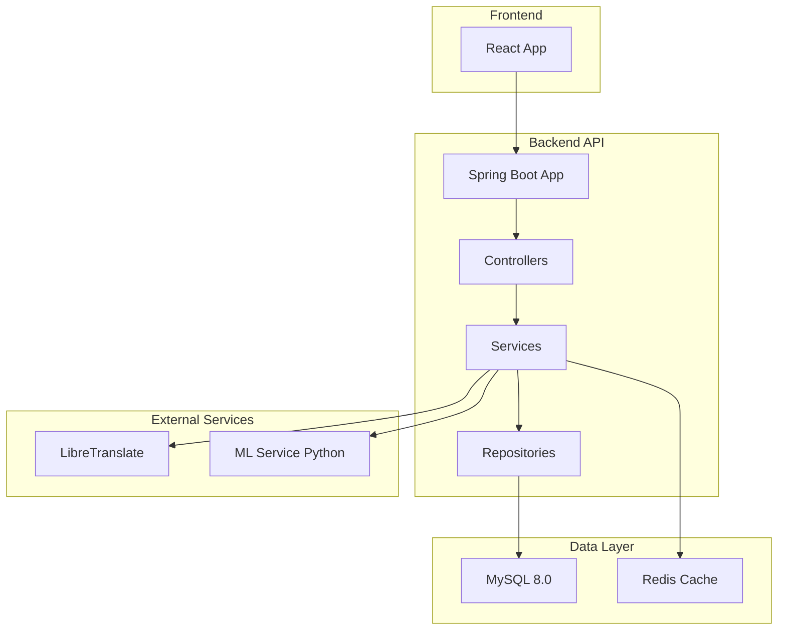

# fideli-crm-backend
 FideliCRM, an Enterprise-grade backend application using Spring Boot 3, PostgreSQL, RabbitMQ, and LocalStack (S3).

 ## 🏗️ Arquitectura

```mermaid
graph TB
    subgraph "Frontend"
        A[React App]
    end
    
    subgraph "Backend API"
        B[Spring Boot App]
        C[Controllers]
        D[Services]
        E[Repositories]
    end
    
    subgraph "External Services"
        F[LibreTranslate]
        G[ML Service Python]
    end
    
    subgraph "Data Layer"
        H[MySQL 8.0]
        I[Redis Cache]
    end
    
    A --> B
    B --> C
    C --> D
    D --> E
    D --> F
    D --> G
    E --> H
    D --> I
```
