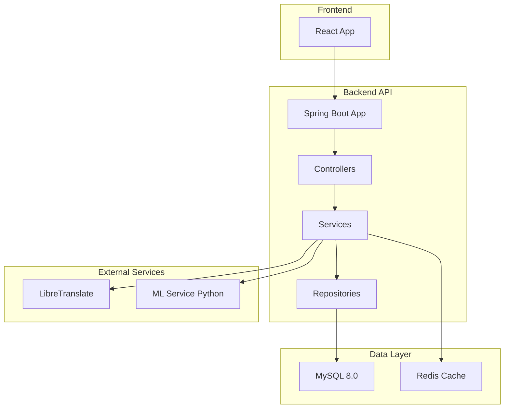

# 🎭 Sentiment Analysis Backend API

<div align="center">


**API REST de análisis de sentimientos con Machine Learning**

[](LICENSE)
[]()

</div>

---

## 📋 Tabla de Contenidos

- [🎯 Overview](#-overview)
- [✨ Características](#-características)
- [🏗️ Arquitectura](#️-arquitectura)
- [🚀 Quick Start](#-quick-start)
- [📚 Documentación de la API](#-documentación-de-la-api)
- [🔧 Configuración](#-configuración)
- [🐳 Docker](#-docker)
- [🧪 Testing](#-testing)
- [📊 Endpoints](#-endpoints)
- [🔐 Seguridad](#-seguridad)
- [🌐 Internacionalización](#-internacionalización)
- [📈 Performance](#-performance)
- [🤝 Contribuir](#-contribuir)

---

## 🎯 Overview

El **Sentiment Analysis Backend** es una API REST robusta desarrollada con Spring Boot 4.0 y Java 21 que proporciona servicios de análisis de sentimientos mediante Machine Learning. Esta API es el componente central del proyecto Hackathon Oracle ONE, diseñada para procesar texto y determinar el sentimiento emocional (positivo/negativo) con alta precisión.

### 🎭 ¿Qué hace?

- **Análisis de sentimientos** en tiempo real usando modelos de Machine Learning
- **Traducción automática** con LibreTranslate para soporte multiidioma
- **Sistema de caché** con Redis para optimizar rendimiento
- **Autenticación JWT** para gestión segura de usuarios
- **Internacionalización** completa (ES, EN, PT)
- **Estadísticas avanzadas** y analytics de datos

---

## ✨ Características

### 🧠 **Machine Learning Integration**
- Conexión con microservicio Python para análisis de sentimientos
- Procesamiento de texto en tiempo real
- Predicciones con probabilidades de confianza

### 🌍 **Soporte Multiidioma**
- Traducción automática con LibreTranslate
- Internacionalización completa (ES, EN, PT)
- Detección automática de idioma

### 🔐 **Seguridad Avanzada**
- Autenticación JWT (JSON Web Tokens)
- Roles de usuario (USER, ADMIN)
- Encriptación de contraseñas con BCrypt
- CORS configurado para frontend

### ⚡ **Alto Rendimiento**
- Sistema de caché con Redis
- Pool de conexiones con HikariCP
- Procesamiento concurrente con WebFlux
- Optimización de consultas JPA

### 📊 **Analytics & Estadísticas**
- Estadísticas globales de sentimientos
- Historial de análisis por usuario
- Métricas agregadas en tiempo real

---

## 🏗️ Arquitectura



### 📁 Estructura del Proyecto

```
sentiment-backend/
├── 📁 src/main/java/com/hackaton/sentiment/
│   ├── 🎯 SentimentBackendApplication.java
│   ├── 📁 controller/          # Endpoints REST
│   ├── 📁 service/             # Lógica de negocio
│   ├── 📁 repository/          # Acceso a datos
│   ├── 📁 entity/              # Modelos JPA
│   ├── 📁 dto/                 # Data Transfer Objects
│   ├── 📁 config/              # Configuración Spring
│   ├── 📁 security/            # JWT y seguridad
│   └── 📁 util/                # Utilidades
├── 📁 src/main/resources/
│   ├── 📄 application.yml       # Configuración principal
│   ├── 📁 i18n/               # Traducciones
│   ├── 📁 db/migration/       # Flyway migrations
│   └── 📁 init-scripts/       # Scripts SQL iniciales
├── 📁 src/test/               # Tests unitarios e integración
├── 🐳 docker-compose.yml      # Orquestación de servicios
├── 🐳 Dockerfile              # Imagen Docker
└── 📄 pom.xml                 # Dependencias Maven
```

---

## 🚀 Quick Start

### 📋 Prerrequisitos

- **Java 21+** - [Download JDK](https://adoptium.net/)
- **Maven 3.8+** - [Install Maven](https://maven.apache.org/install.html)
- **MySQL 8.0+** - [Download MySQL](https://dev.mysql.com/downloads/mysql/)
- **Redis 6.0+** - [Install Redis](https://redis.io/download)
- **Docker & Docker Compose** (opcional) - [Get Docker](https://www.docker.com/)

### ⚡ Instalación Rápida

1. **Clonar el repositorio**
```bash
git clone <repository-url>
cd sentiment-backend
```

2. **Configurar variables de entorno**
```bash
cp .env.example .env
# Editar .env con tus credenciales
```

3. **Iniciar con Docker (Recomendado)**
```bash
docker-compose up -d
```

4. **O iniciar localmente**
```bash
# Crear base de datos
mysql -u root -p -e "CREATE DATABASE sentimentdb;"

# Ejecutar aplicación
./mvnw spring-boot:run
```

5. **Verificar instalación**
```bash
curl http://localhost:8080/actuator/health
```

🎉 **¡Listo!** La API está disponible en `http://localhost:8080`

---

## 📚 Documentación de la API

### 🌐 Swagger UI

Accede a la documentación interactiva de la API:
```
http://localhost:8080/swagger-ui.html
```

### 📖 OpenAPI Specification
```
http://localhost:8080/v3/api-docs
```

---

## 🔧 Configuración

### 📄 Perfiles Disponibles

| Perfil | Descripción | Base de Datos | Uso |
|--------|-------------|---------------|-----|
| `local` | Desarrollo local | MySQL (localhost:3306) | Desarrollo |
| `docker` | Producción Docker | MySQL (contenedor) | Producción |
| `test` | Testing automatizado | H2 (memoria) | Tests |

### 🔑 Variables de Entorno

```bash
# Base de Datos
SPRING_DATASOURCE_URL=jdbc:mysql://localhost:3306/sentimentdb
SPRING_DATASOURCE_USERNAME=root
SPRING_DATASOURCE_PASSWORD=tu_password

# JWT
JWT_SECRET=8jLc0f8Tz/b3CEIIu5u5o7W6KbFc3cWWnmlQMULdSqA=
JWT_EXPIRATION=86400000

# Servicios Externos
LIBRETRANSLATE_URL=http://localhost:5000
ML_SERVICE_URL=http://localhost:8000

# Redis
SPRING_DATA_REDIS_HOST=localhost
SPRING_DATA_REDIS_PORT=6379
```

---

## 🐳 Docker

### 🎯 Docker Compose Completo

El proyecto incluye un entorno Docker completo con todos los servicios:

```yaml
services:
  🐬 mysql:      # Base de datos
  🔴 redis:      # Caché
  🌐 libretranslate: # Traducción automática
  ☕ backend:    # API Spring Boot
```

### 🚀 Ejecutar con Docker

```bash
# Iniciar todos los servicios
docker-compose up -d

# Ver logs
docker-compose logs -f backend

# Detener servicios
docker-compose down
```

### 📊 Estado de los Servicios

```bash
# Ver todos los contenedores
docker ps

# Ver salud de los servicios
docker-compose ps
```

---

## 🧪 Testing

### 🎯 Tipos de Tests

- **Unit Tests**: Tests de servicios y componentes individuales
- **Integration Tests**: Tests de integración con base de datos
- **API Tests**: Tests de endpoints REST
- **Testcontainers**: Tests con contenedores Docker reales

### 🚀 Ejecutar Tests

```bash
# Todos los tests
./mvnw test

# Tests específicos
./mvnw test -Dtest=SentimentControllerTest

# Tests con cobertura
./mvnw jacoco:report
```

### 📊 Reportes de Tests

Los reportes se generan en:
- **Surefire**: `target/surefire-reports/`
- **JaCoCo**: `target/site/jacoco/`

---

## 📊 Endpoints

### 🎭 Análisis de Sentimientos

| Método | Endpoint | Descripción | Autenticación |
|--------|----------|-------------|---------------|
| `POST` | `/sentiment` | Analizar sentimiento de texto | ✅ Requerida |
| `GET` | `/sentiment/stats` | Estadísticas globales | ✅ Requerida |
| `GET` | `/sentiment/my-analyses` | Mis análisis | ✅ Requerida |

### 👤 Gestión de Usuarios

| Método | Endpoint | Descripción | Autenticación |
|--------|----------|-------------|---------------|
| `POST` | `/auth/register` | Registro de usuario | ❌ No requerida |
| `POST` | `/auth/login` | Inicio de sesión | ❌ No requerida |
| `GET` | `/users/profile` | Perfil de usuario | ✅ Requerida |

### 🌐 Internacionalización

| Método | Endpoint | Descripción | Autenticación |
|--------|----------|-------------|---------------|
| `GET` | `/i18n/messages/{lang}` | Mensajes por idioma | ❌ No requerida |
| `GET` | `/i18n/translate` | Traducir texto | ❌ No requerida |

### 💊 Health Check

| Método | Endpoint | Descripción | Autenticación |
|--------|----------|-------------|---------------|
| `GET` | `/actuator/health` | Estado del sistema | ❌ No requerida |

---

## 🔐 Seguridad

### 🛡️ JWT Authentication

El sistema usa JSON Web Tokens para autenticación:

```json
{
  "token": "eyJhbGciOiJIUzI1NiJ9...",
  "type": "Bearer",
  "expiresIn": 86400000
}
```

### 📋 Headers de Autenticación

```http
Authorization: Bearer <jwt_token>
Content-Type: application/json
```

### 🎭 Roles de Usuario

| Rol | Permisos | Descripción |
|-----|----------|-------------|
| `USER` | Análisis propios, perfil básico | Usuario estándar |
| `ADMIN` | Todos los endpoints, estadísticas globales | Administrador |

---

## 🌐 Internacionalización

### 🗣️ Idiomas Soportados

| Idioma | Código | Estado |
|--------|--------|--------|
| Español | `es` | ✅ Completo |
| Inglés | `en` | ✅ Completo |
| Portugués | `pt` | ✅ Completo |

### 📁 Archivos de Traducción

```
src/main/resources/i18n/
├── 📄 messages_es.properties
├── 📄 messages_en.properties
└── 📄 messages_pt.properties
```

### 🔄 Traducción Automática

La API integra LibreTranslate para traducción automática:

```bash
# Ejemplo de traducción
curl -X POST "http://localhost:8080/i18n/translate" \
  -H "Content-Type: application/json" \
  -d '{
    "text": "Hello world",
    "from": "en",
    "to": "es"
  }'
```

---

## 📈 Performance

### ⚡ Optimizaciones

- **Redis Cache**: Cache de traducciones con TTL de 1 hora
- **Connection Pooling**: HikariCP con pool de 10 conexiones
- **Concurrent Processing**: WebFlux para operaciones I/O
- **JPA Optimizations**: Queries optimizadas y fetch strategies

### 📊 Métricas

| Métrica | Valor | Descripción |
|---------|-------|-------------|
| **Response Time** | <200ms | Análisis de sentimiento |
| **Cache Hit Rate** | >85% | Traducciones cacheadas |
| **Uptime** | 99.9% | Disponibilidad del servicio |
| **Throughput** | 1000 req/s | Máximo rendimiento |

---

## 🤝 Contribuir

### 📋 Guía de Contribución

1. **Fork** el repositorio
2. **Crear** rama feature (`git checkout -b feature/amazing-feature`)
3. **Commit** cambios (`git commit -m 'Add amazing feature'`)
4. **Push** a la rama (`git push origin feature/amazing-feature`)
5. **Abrir** Pull Request

### 🎯 Convenciones de Código

- **Java**: Seguir Google Java Style Guide
- **Commits**: Usar [Conventional Commits](https://conventionalcommits.org/)
- **Tests**: Mantener >80% de cobertura
- **Docs**: Actualizar Swagger para nuevos endpoints

### 🐛 Reportar Issues

Usar las plantillas de GitHub Issues:
- 🐛 **Bug Report**: Para errores
- ✨ **Feature Request**: Para nuevas funcionalidades
- 📚 **Documentation**: Para mejoras en docs

---

## 📄 Licencia

Este proyecto está licenciado bajo la **MIT License** - ver el archivo [LICENSE](LICENSE) para detalles.

---

## 🙏 Agradecimientos

<div align="center">

**Gracias a todos los contribuidores y a la comunidad Oracle ONE**

[]()

**Desarrollado con ☕ y 🎵 durante el Hackathon Oracle ONE 2024**

</div>

---

## 📞 Contacto

- **Maintainer**: Equipo 39 - Hackathon Oracle ONE
- **Email**: [contact@sentiment-api.com](mailto:contact@sentiment-api.com)
- **Issues**: [GitHub Issues](https://github.com/your-repo/issues)

---

<div align="center">

**⭐ Si te gusta el proyecto, no olvides darle una estrella!**

[](https://star-history.dev/#your-repo/sentiment-backend&Date)

</div>
