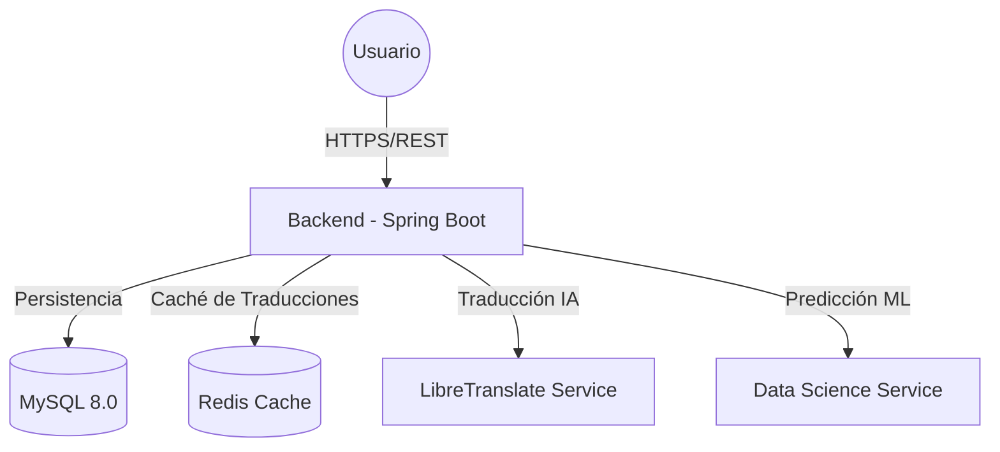

<div align="center">

# 🧠 API de Análisis de Sentimiento
### 🚀 Hackathon Oracle ONE - Sistema Backend


<p align="center">
  <a href="#-sobre-el-proyecto">Descripción</a> •
  <a href="#-arquitectura-del-sistema">Arquitectura</a> •
  <a href="#-características-principales">Características</a> •
  <a href="#-comenzando">Instalación</a> •
  <a href="#-documentación-de-api">API Docs</a>
</p>

</div>

---

## 📖 Sobre el Proyecto

La **API de Análisis de Sentimiento** es el núcleo backend de una solución integral desarrollada para el **Hackathon Oracle ONE**. Su propósito es procesar comentarios de usuarios, analizar su tono emocional (Positivo, Neutral, Negativo) utilizando modelos de Inteligencia Artificial y proporcionar servicios de traducción en tiempo real.

Construido sobre prácticas modernas de ingeniería de software con **Java 21** y **Spring Boot 4**, este sistema actúa como orquestador central, gestionando la comunicación segura y eficiente entre los microservicios de Data Science, la interfaz de usuario y las bases de datos.

## 🏗 Arquitectura del Sistema

El sistema utiliza una arquitectura de microservicios contenerizada, diseñada para ser escalable y resiliente. Todos los componentes se orquestan mediante Docker Compose.



### 🧩 Componentes Detallados

1.  **Backend (Spring Boot)**:
    *   Gestiona la lógica de negocio, autenticación JWT y validación de datos.
    *   Implementa patrones de diseño robustos y manejo de excepciones global.
    *   Expone una API RESTful documentada con OpenAPI.

2.  **Base de Datos (MySQL 8.0)**:
    *   Almacena perfiles de usuario, historial de análisis y configuraciones.
    *   Utiliza **Flyway** para migraciones de base de datos controladas y versionadas.
    *   Configurada con volúmenes persistentes para evitar pérdida de datos.

3.  **Caché (Redis)**:
    *   Optimiza el rendimiento almacenando resultados de traducciones frecuentes.
    *   Reduce la carga sobre el servicio de traducción y mejora la latencia de respuesta.
    *   Configuración LRU (Least Recently Used) para gestión eficiente de memoria.

4.  **Traducción (LibreTranslate)**:
    *   Servicio de traducción neuronal autohospedado (sin dependencia de APIs externas costosas).
    *   Soporte configurado para **Español, Inglés y Portugués**.

## ✨ Características Principales

*   **🔍 Análisis de Sentimiento Inteligente**: Integración con modelos de Machine Learning para evaluar el tono emocional de textos en múltiples idiomas.
*   **🌐 Soporte Multilingüe Real**:
    *   Traducción automática de comentarios antes del análisis.
    *   Sistema preparado para escalar a más idiomas fácilmente.
*   **⚡ Alto Rendimiento y Escalabilidad**:
    *   Implementación de caché distribuida con Redis.
    *   Procesamiento asíncrono para tareas pesadas.
*   **🔒 Seguridad de Grado Empresarial**:
    *   Autenticación Stateless mediante **JWT (JSON Web Tokens)**.
    *   Seguridad configurada con Spring Security.
    *   Protección CORS y headers de seguridad.
*   **🛠 Experiencia de Desarrollo Superior**:
    *   **Hot Reload** habilitado en entorno Docker con Spring DevTools.
    *   Despliegue de un solo comando (`docker-compose up`).
    *   Documentación interactiva con Swagger UI.

## 🚀 Comenzando

Sigue estos pasos para levantar el entorno de desarrollo completo en tu máquina local.

### Prerrequisitos

Asegúrate de tener instalado lo siguiente:
*   **Docker Desktop**: Versión 4.0+ (con Docker Compose V2).
*   **Git**: Para clonar el repositorio.
*   *(Opcional)* **Java JDK 21**: Solo si deseas ejecutar el backend fuera de Docker.
*   *(Opcional)* **Maven 3.9+**: Solo para builds locales manuales.

### 🔧 Guía de Instalación Paso a Paso

1.  **Clonar el Repositorio**
    Descarga el código fuente en tu máquina local:
    ```bash
    git clone https://github.com/tu-organizacion/sentiment-api.git
    cd sentiment-api/backend/sentiment-backend
    ```

2.  **Configuración de Variables de Entorno**
    El sistema requiere ciertas variables sensibles. Crea un archivo `.env` en la raíz de la carpeta `sentiment-backend` con el siguiente contenido:

    ```env
    # --- Base de Datos ---
    # Contraseña root para MySQL (¡Usa una contraseña fuerte!)
    DB_ADMIN0_1_PASSWORD=secret_mysql_password
    
    # --- Seguridad JWT ---
    # Clave secreta para firmar tokens (debe ser larga y compleja en base64)
    # Puedes generar una online o usar un string aleatorio largo
    JWT_SECRET=tu_clave_secreta_super_segura_base64_encoded
    # Tiempo de expiración del token en milisegundos (ej: 24 horas)
    JWT_EXPIRATION=86400000
    
    # --- URLs de Servicios Internos (Docker) ---
    # No cambies esto si usas docker-compose
    LIBRETRANSLATE_URL=http://libretranslate:5000
    ML_SERVICE_URL=http://datascience:8000
    ```

3.  **Despliegue con Docker Compose**
    Construye e inicia todos los servicios. La primera vez tomará unos minutos mientras descarga las imágenes y compila el backend.

    ```bash
    docker-compose up -d --build
    ```
    
    > **Nota:** El servicio `libretranslate` puede tardar un par de minutos adicionales en iniciar ya que descarga modelos de lenguaje en el primer arranque.

4.  **Verificación del Estado**
    Puedes ver los logs en tiempo real para confirmar que todo funciona:
    ```bash
    docker-compose logs -f backend
    ```
    Espera hasta ver el mensaje: `Started SentimentBackendApplication in ... seconds`.

## 📡 Documentación de API

Una vez que el sistema esté en funcionamiento, tendrás acceso a la documentación interactiva generada automáticamente por **SpringDoc OpenAPI**.

Accede desde tu navegador a:
👉 **[http://localhost:8080/swagger-ui.html](http://localhost:8080/swagger-ui.html)**

### Endpoints Clave

| Método | Endpoint | Descripción |
| :--- | :--- | :--- |
| **AUTH** | | |
| `POST` | `/api/v1/auth/register` | Registrar un nuevo usuario |
| `POST` | `/api/v1/auth/login` | Iniciar sesión y obtener Bearer Token |
| **ANÁLISIS** | | |
| `POST` | `/api/v1/sentiment/analyze` | Analizar texto (detecta idioma y traduce auto) |
| `GET` | `/api/v1/sentiment/history` | Ver historial de análisis del usuario |
| **UTILIDADES** | | |
| `GET` | `/api/v1/translations/languages` | Listar idiomas soportados |
| `GET` | `/health` | Verificar estado del sistema (Health Check) |

## 🛠 Stack Tecnológico Detallado

| Componente | Tecnología | Versión | Propósito |
| :--- | :--- | :--- | :--- |
| **Lenguaje** | Java | 21 (LTS) | Lenguaje base moderno y performante |
| **Framework** | Spring Boot | 4.0.0 | Desarrollo rápido de aplicaciones REST |
| **Base de Datos** | MySQL | 8.0 | Persistencia relacional robusta |
| **Migraciones** | Flyway | - | Control de versiones de esquema de BD |
| **Caché** | Redis | Alpine | Almacenamiento clave-valor en memoria |
| **Seguridad** | Spring Security | 6+ | Autenticación y Autorización |
| **Docs** | SpringDoc OpenAPI | 2.8.14 | Generación automática de Swagger UI |
| **Testing** | JUnit 5 | - | Pruebas unitarias y de integración |

## 📂 Estructura del Proyecto

Entender la estructura de carpetas te ayudará a navegar por el código:

```text
sentiment-backend/
├── 🐳 docker-compose.yml     # Orquestación de todos los servicios
├── 🐘 pom.xml                # Gestión de dependencias Maven
├── 📜 Dockerfile             # Definición de la imagen del Backend
├── 📂 src/
│   ├── 📂 main/
│   │   ├── ☕ java/com/hackaton/sentiment/
│   │   │   ├── 🎮 controller/    # Controladores REST (Entry points)
│   │   │   ├── 🧠 service/       # Lógica de negocio
│   │   │   ├── 💾 repository/    # Acceso a datos (JPA)
│   │   │   ├── 📦 entity/        # Modelos de Base de Datos
│   │   │   ├── 📨 dto/           # Objetos de Transferencia de Datos
│   │   │   └── 🛡 security/      # Configuración JWT y Filtros
│   │   └── ⚙️ resources/
│   │       ├── 📜 application.yml # Configuración de Spring Boot
│   │       └── 🗄 db/migration/   # Scripts SQL de Flyway
│   └── 🧪 test/                   # Tests unitarios y de integración
└── 📝 README.md              # Este archivo
```

## ❓ Solución de Problemas Comunes

**1. El servicio Backend falla al iniciar conectando a MySQL.**
*   *Causa:* MySQL tarda más en iniciar que el backend la primera vez.
*   *Solución:* El contenedor tiene un `healthcheck` y reintentos, pero si falla, simplemente reinicia el backend: `docker-compose restart backend`.

**2. Error de conexión con LibreTranslate.**
*   *Causa:* LibreTranslate está descargando modelos (puede tardar 5-10 min dependiendo de internet).
*   *Solución:* Verifica los logs con `docker-compose logs -f libretranslate` y espera a que indique que está listo en el puerto 5000.

---

<div align="center">
  <p>Desarrollado con ❤️ y ☕ por el <b>Equipo 39</b> para el Hackathon Oracle ONE</p>
  <p><i>Código limpio, escalable y bien documentado.</i></p>
</div>
